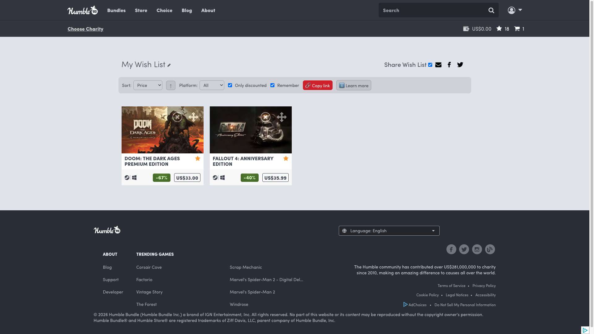
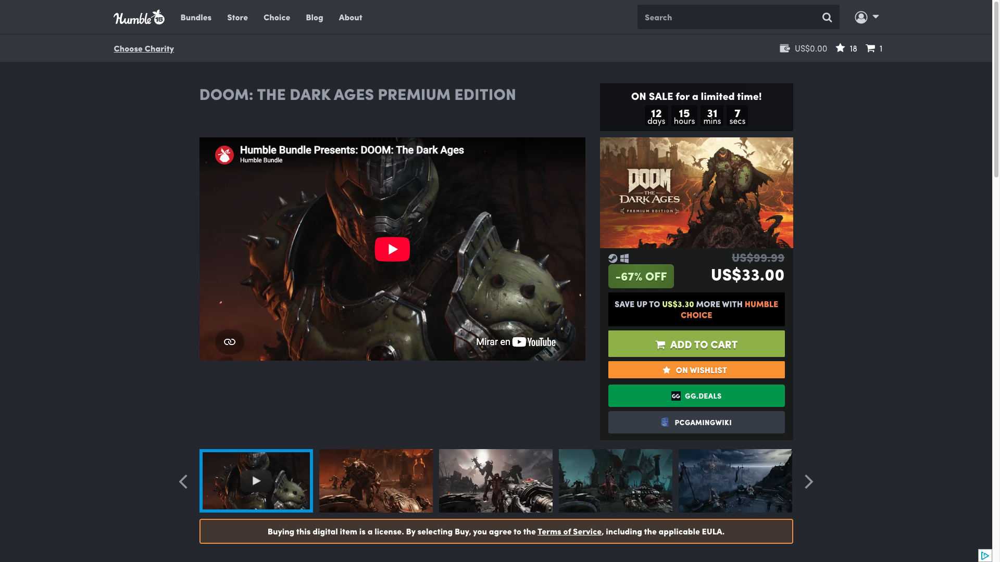

# Humble Bundle Tools

Tampermonkey userscript for the Humble Store: wishlist tools plus GG.deals and PCGamingWiki buttons. / Userscript de Tampermonkey para la Humble Store: herramientas de lista de deseos y botones a GG.deals y PCGamingWiki.

*Wishlist (`/wishlist`): sort, direction, platform filter, "only discounted", "remember", copy link and "Learn more", all in one row above your games. / Lista de deseos (`/wishlist`): orden, dirección, filtro de plataforma, "solo con descuento", "recordar", copiar enlace y "Saber más", todo en una fila sobre tus juegos.*

*Product page (`/store/`): both buttons close the purchase column, below "Add to cart" and the wishlist button. / Página de producto (`/store/`): los dos botones cierran la columna de compra, bajo "Add to cart" y el botón de lista de deseos.*

## English

### What it does

**Wishlist (`/wishlist`)**
- **Sort** by date added, name, price or discount percentage, with an **↑ / ↓ toggle** for ascending or descending. "Added" restores Humble's own original order — it is read from the index Humble puts on each row, not guessed from the current layout.
- **Filter by platform:** Steam, Epic, GOG, Ubisoft, EA, key or DRM-free. The dropdown is **built from what is actually in your list**, so it never offers a platform that would return nothing.
- **Only discounted:** hides everything that is not on sale. A game counts as discounted if Humble marks it on sale *or* if the original price is higher than the current one, and when the percentage badge is missing the script works the discount out from the two prices — so sorting by discount stays correct either way.
- **Remember:** saves your sort and filters and reapplies them when you come back. Turn it off and nothing is written: the toolbar stops persisting anything.
- **Copy link:** builds a URL that reproduces your sort, direction, platform and "only discounted" when opened. The parameters are **plain and readable** (`wlsort`, `wldir`, `wlplat`, `wldisc`), so the link is bookmarkable and you can even edit it by hand. If the browser blocks clipboard access, the URL is shown in a dialog so you can copy it yourself.
- **"Learn more"** button with the full explanation inside the page, and a tooltip on every control.

**Product pages (`/store/`)**
- Adds a **GG.deals** button (prices and deals across stores) and a **PCGamingWiki** button (fixes, technical notes, known issues), stacked at the end of the purchase column.
- **Only on PC games.** The script checks the price grid for a PC platform icon first, so console-only products are left alone — PCGamingWiki would have nothing to say about them.
- Both search by the game's title, which is **cleaned first**: the commercial wrapping Humble adds ("Buy …", "… on Humble Store", trademark symbols) is stripped so the search sees the name and nothing else.
- The PCGamingWiki logo travels **inline as SVG**, because its favicon returns 403 to hotlinking; the GG.deals favicon loads as a normal image and, if it were ever blocked, removes itself and leaves the button working with just its label.
- Both open in a new tab, with `rel="nofollow noopener external"`.

**Language:** automatic Spanish / English detection, following the language Humble serves the page in.

**Install:**
1. Install [Tampermonkey](https://www.tampermonkey.net/).
2. Open the installer: [humble-bundle-tools.user.js](https://github.com/g31w0fw0rld/humble-bundle-tools/raw/main/humble-bundle-tools.user.js) (also on [GreasyFork](https://greasyfork.org/es-419/users/1590477-g31w) and [OpenUserJS](https://openuserjs.org/users/g31w0fw0rldgmail.com/scripts)).

**Site:** `humblebundle.com`

## Español

### Qué hace

**Lista de deseos (`/wishlist`)**
- **Ordenar** por fecha de agregado, nombre, precio o porcentaje de descuento, con un **botón ↑ / ↓** para ascendente o descendente. "Agregado" restaura el orden original de Humble — se lee del índice que Humble pone en cada fila, no se adivina de la maquetación actual.
- **Filtrar por plataforma:** Steam, Epic, GOG, Ubisoft, EA, clave o sin DRM. El desplegable **se arma con lo que realmente hay en tu lista**, así que nunca ofrece una plataforma que devolvería cero.
- **Solo con descuento:** oculta todo lo que no está en oferta. Un juego cuenta como rebajado si Humble lo marca en oferta *o* si el precio original es mayor que el actual, y cuando falta el badge de porcentaje el script lo calcula a partir de los dos precios — así ordenar por descuento sigue siendo correcto en cualquier caso.
- **Recordar:** guarda tu orden y tus filtros y los reaplica al volver. Si lo apagas no se escribe nada: la barra deja de persistir.
- **Copiar enlace:** genera una URL que al abrirla reproduce tu orden, dirección, plataforma y "solo con descuento". Los parámetros son **legibles** (`wlsort`, `wldir`, `wlplat`, `wldisc`), así que el enlace se puede guardar en marcadores e incluso editar a mano. Si el navegador bloquea el portapapeles, muestra la URL en un diálogo para copiarla tú.
- Botón **"Saber más"** con la explicación completa dentro de la página, y un tooltip en cada control.

**Páginas de producto (`/store/`)**
- Añade un botón de **GG.deals** (precios y ofertas entre tiendas) y otro de **PCGamingWiki** (arreglos, notas técnicas, problemas conocidos), apilados al final de la columna de compra.
- **Solo en juegos de PC.** El script comprueba antes que la parrilla de precios tenga un icono de plataforma PC, así que los productos solo de consola se quedan sin botones — PCGamingWiki no tendría nada que decir de ellos.
- Los dos buscan por el título del juego, que se **limpia antes**: el envoltorio comercial que añade Humble ("Comprar …", "… en la tienda Humble", símbolos de marca registrada) se quita para que la búsqueda vea el nombre y nada más.
- El logo de PCGamingWiki viaja **como SVG en línea**, porque su favicon devuelve 403 al enlazarlo desde fuera; el favicon de GG.deals carga como imagen normal y, si alguna vez lo bloquearan, se quita solo y deja el botón funcionando con su etiqueta.
- Los dos abren en una pestaña nueva, con `rel="nofollow noopener external"`.

**Idioma:** detección automática español / inglés, siguiendo el idioma con el que Humble sirve la página.

**Instalación:**
1. Instala [Tampermonkey](https://www.tampermonkey.net/).
2. Abre el instalador: [humble-bundle-tools.user.js](https://github.com/g31w0fw0rld/humble-bundle-tools/raw/main/humble-bundle-tools.user.js) (también en [GreasyFork](https://greasyfork.org/es-419/users/1590477-g31w) y [OpenUserJS](https://openuserjs.org/users/g31w0fw0rldgmail.com/scripts)).

**Sitio:** `humblebundle.com`

## Privacy / Privacidad

**EN:** the script makes no network requests: it reads titles, prices and platforms from the page itself to sort and filter, and builds the GG.deals and PCGamingWiki links from the game title. It declares `@grant none`, so it has no access to the userscript manager's privileged APIs (storage, cross-origin requests). It stores in `localStorage` on `humblebundle.com` (key `hbwl-settings`) only your sort order and filters — and only while "Remember" is on; the copy-link button writes to the clipboard only when you click it. Nothing is sent to third parties or to the author, and you only visit GG.deals or PCGamingWiki if you click a button.

**ES:** el script no hace ninguna petición de red: lee de la propia página los títulos, precios y plataformas para ordenar y filtrar, y construye los enlaces a GG.deals y PCGamingWiki a partir del título del juego. Declara `@grant none`, así que no tiene acceso a las APIs privilegiadas del gestor de userscripts (almacenamiento, peticiones entre dominios). Guarda en `localStorage` de `humblebundle.com` (clave `hbwl-settings`) solo tu orden y tus filtros —y solo mientras "Recordar" esté activo—; el botón de copiar enlace escribe en el portapapeles únicamente cuando haces clic. No se envía nada a terceros ni al autor, y solo visitas GG.deals o PCGamingWiki si haces clic en un botón.

## Support / Apoyar

This is part of something I'm building to grow. If it helps you and you'd like to support it, you can tip me on **[Ko-fi](https://ko-fi.com/g31w0fw0rld)** —only if you want—; and if a cause needs it more than I do, help that one instead.

Esto es parte de algo que estoy construyendo para crecer. Si te sirve y quieres apoyar, puedes invitarme un café en **[Ko-fi](https://ko-fi.com/g31w0fw0rld)** —solo si quieres—; y si hay una causa que lo necesite más que yo, ayúdala a ella.

---
Author / Autor: **g31w0fw0rld** · License / Licencia: **MIT**
